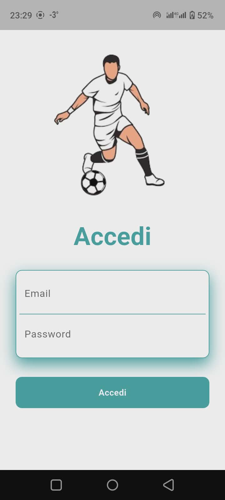
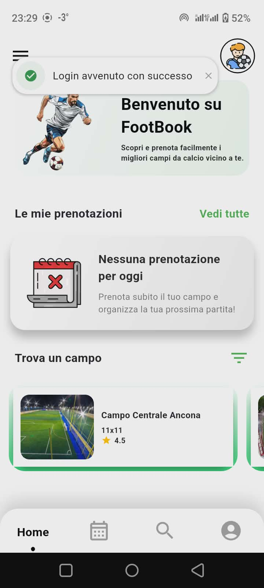
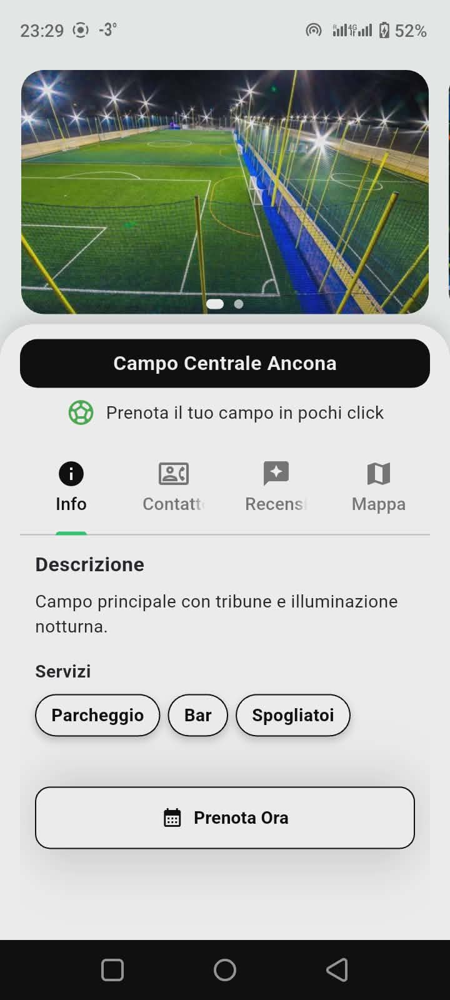
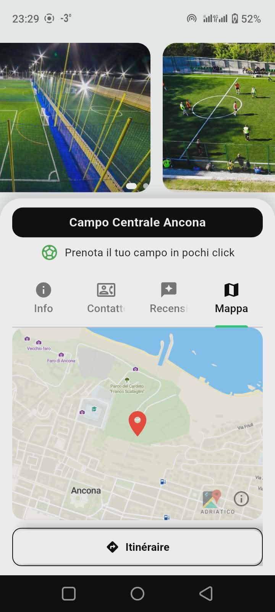

# FootBook

## Informazioni Studente
- Nome: Mejri Mohamed Ali  
- Matricola: 343329

## Titolo del Progetto
FootBook – Applicazione mobile per la prenotazione dei campi da calcio

## Descrizione del Progetto
FootBook è un’applicazione mobile progettata per semplificare la prenotazione dei campi
da calcio. L’app consente agli utenti di visualizzare la disponibilità dei campi,
selezionare data e ora, prenotare un campo e completare il pagamento online tramite
un’interfaccia semplice e intuitiva.

## Esperienza Utente
L’utente accede all’app tramite login o registrazione. Dopo l’autenticazione, può
consultare l’elenco dei campi disponibili e verificarne la disponibilità attraverso
un calendario chiaro e intuitivo. Una volta selezionati campo, data e ora, la
prenotazione viene confermata tramite pagamento online. L’esperienza utente è fluida
e progettata per essere semplice e veloce.

## Screenshot

### Schermata di Login
{width=200px}

### Schermata Principale
{width=200px}

### Schermata di Camp 
{width=200px}

### Schermata di Mappa 
{width=200px}

## Tecnologie Utilizzate
- Flutter e Dart per lo sviluppo dell’applicazione mobile
- API REST per la comunicazione con il backend
- Laravel per il backend e la gestione dei dati
- Sistema di pagamento online
- Git e GitHub per il controllo di versione

Sono stati utilizzati specifici pacchetti Flutter per la gestione della navigazione,
dell’interfaccia utente e delle richieste HTTP. L’applicazione comunica con un server
remoto per recuperare i dati di disponibilità e gestire le prenotazioni. Durante lo
